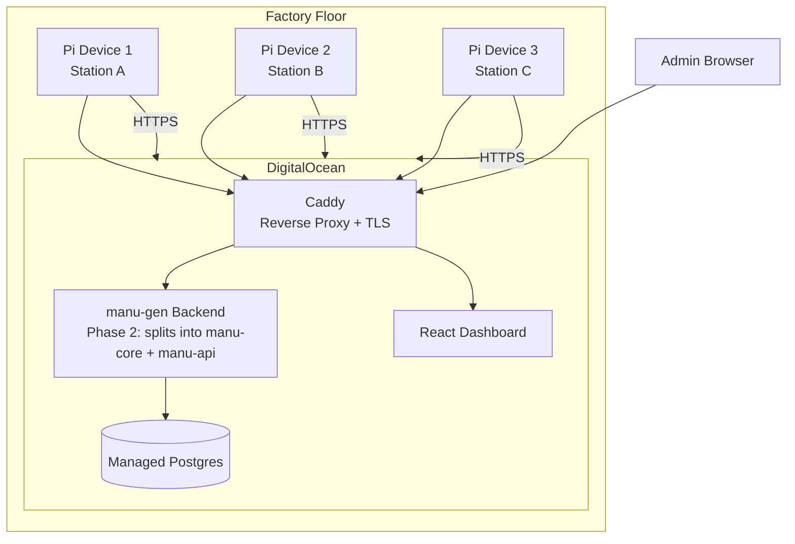
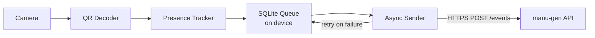
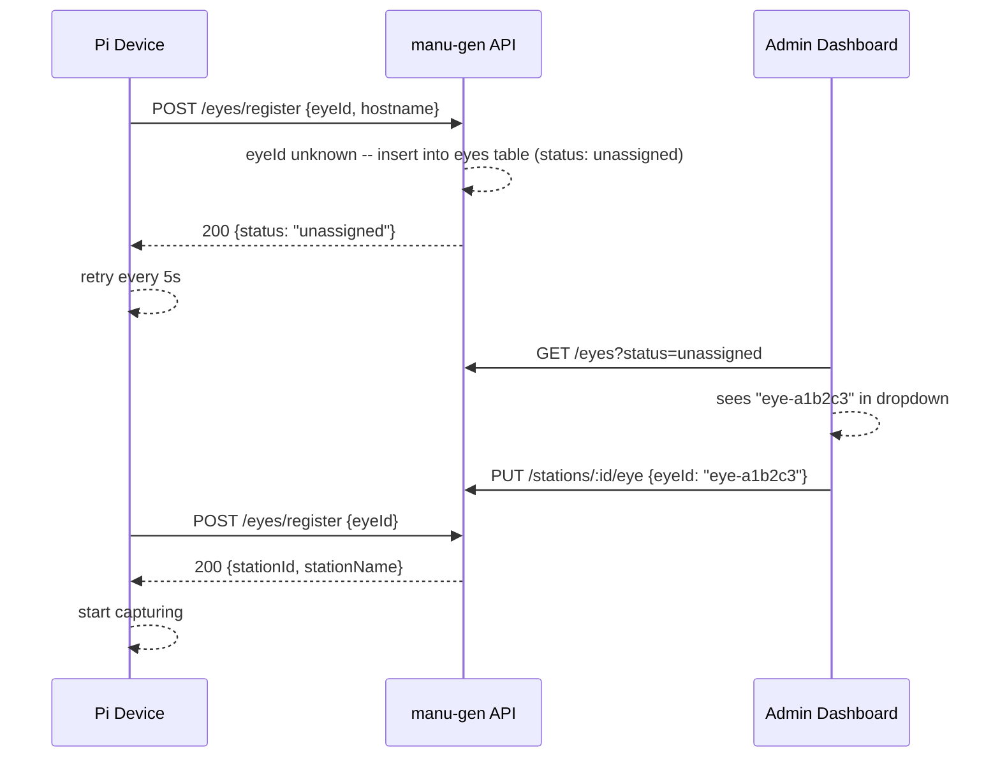
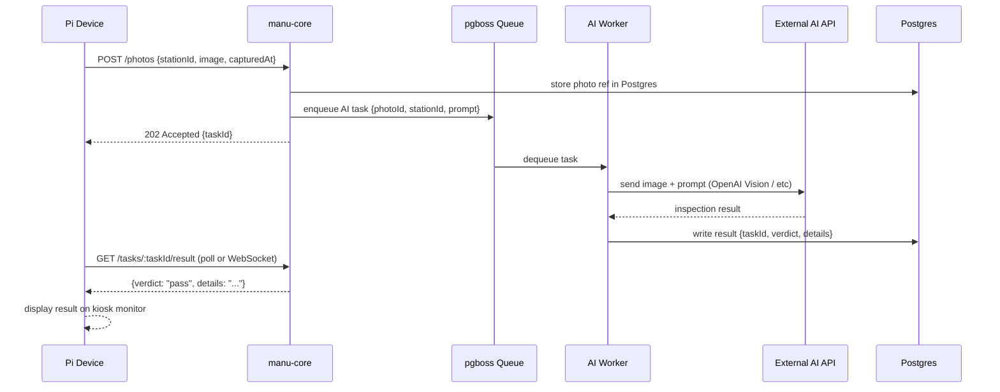

# IoT Station Device Architecture Plan

## 1. Current System Summary

**manu-eye** today is a Python process running on your laptop that:

- Opens a local USB webcam via OpenCV (`cv2.VideoCapture(0)`)
- Decodes QR codes with pyzbar (ZBar) at ~5 fps
- Tracks tray presence with hysteresis (arrived/departed transitions)
- Registers with backend via `POST /eyes/register` to resolve `eyeId` -> `stationId`
- Sends events via `POST /events` (trayCode, stationId, eyeId, capturedAt, phase)

**manu-gen backend** stores events in SQLite today (migrating to Postgres for production -- see [Production Architecture Plan](production_architecture_plan_87189a29.plan.md)), drives job state machines, and serves a React dashboard. There is **no authentication** on the API today.

The core detection logic is **lightweight** -- no GPU, no ML models, just ZBar QR decoding on CPU. This is excellent news for IoT: a Raspberry Pi can handle this comfortably.

---

## 2. Target Architecture

### 2.1 Topology: Direct-to-Cloud (Recommended for MVP)

Each device connects directly to the backend over the internet. No orchestrator.




**Why not an orchestrator for MVP:**

- Single point of failure (you identified this risk correctly)
- Adds latency and complexity for no benefit at small scale
- Each device is independent -- one going down doesn't affect others
- An edge gateway/orchestrator makes sense at 50+ devices or when local analytics are needed, but not for MVP

### 2.2 Offline Resilience: Local Event Queue

This is the most critical addition to the current architecture.




**Design:**

- Events are **always written to a local SQLite WAL-mode database first** (never lost)
- A background sender thread drains the queue, POSTing events to the backend
- On network failure: events accumulate locally with timestamps intact (`captured_at` is set at detection time, not send time)
- On reconnect: the queue drains in order (FIFO), backend receives events with correct historical timestamps
- A `sent_at` column tracks delivery; successfully ACKed events are marked, periodically purged
- **Bounded queue**: cap at ~~100k events (~~10 MB) to prevent SD card fill; oldest unsent events are dropped if the cap is hit (configurable)

### 2.3 Device Onboarding Flow

**MVP approach: auto-register + assign from dropdown**

The device announces itself to the backend on boot. The admin assigns it to a station from a dropdown (no manual typing of IDs).




**How it works:**

1. Each Pi derives its `EYE_ID` from its MAC address at first boot (e.g., `eye-a1b2c3`) -- deterministic, no manual config
2. On boot, device calls `POST /eyes/register`. Backend creates a row in a new `eyes` table with `status: unassigned` if unknown, returns `{status: "unassigned"}`
3. Admin opens the Stations page, sees unassigned devices in a dropdown, picks one and assigns it to a station
4. Next register poll returns `{stationId, stationName}` -- device starts capturing

**Backend change:** modify `POST /eyes/register` -- instead of 404 for unknown eyes, **upsert** into `eyes(eye_id, hostname, first_seen, last_seen, status)` and return `{status: "unassigned"}`. When assigned to a station, status becomes `"assigned"` and the response includes `stationId`.

**Frontend change:** on the station assignment form, replace the free-text eyeId input with a dropdown populated from `GET /eyes?status=unassigned`.

**Why this is good enough for MVP (single tenant):**

- No multi-org scoping needed yet -- all devices register into one pool
- No typos -- admin picks from discovered devices
- Zero manual config on the Pi beyond flashing the SD card
- When multi-tenancy is needed later, add an `org_id` column to the `eyes` table and scope queries

**Future improvements (post-MVP):**

- Captive portal / local web UI on the Pi for WiFi config
- Bluetooth onboarding via a mobile app
- Organization-scoped device pools

### 2.4 Device Health and Monitoring

Add a **heartbeat** mechanism (not in current manu-eye):

- Device sends `POST /eyes/heartbeat` every 60s with: `eyeId`, `uptime`, `queueDepth` (unsent events), `cameraOk` (boolean), `cpuTemp`, `freeMemMb`
- Backend stores last heartbeat per eye; dashboard shows device status (online/offline/degraded)
- If `queueDepth > threshold`, dashboard warns about connectivity issues

---

## 3. Hardware: Recommended Components for MVP

### 3.1 Compute: Raspberry Pi 4 Model B (2GB RAM)

**Yes, Raspberry Pi is the right choice.** Here's why:

- Full Linux (Raspberry Pi OS / Debian) -- your Python code runs **unmodified**
- Native USB and CSI camera support
- WiFi + Ethernet built in
- Huge community, excellent Python/OpenCV support
- Stable, proven in industrial/kiosk deployments
- 2GB RAM is plenty (manu-eye uses <200 MB)

**Alternative considered:** Raspberry Pi Zero 2 W (~$15) -- has WiFi and runs Python, but single-core performance may struggle with QR decoding at 5fps. Stick with Pi 4 for reliability.

### 3.2 Full BOM (Bill of Materials) for One MVP Unit


| Component                 | Specific Model                              | Approx. Price (USD) | Notes                                                                                  |
| ------------------------- | ------------------------------------------- | ------------------- | -------------------------------------------------------------------------------------- |
| SBC                       | Raspberry Pi 4 Model B 2GB                  | $45                 | 4GB ($55) recommended for stations with kiosk display                                  |
| Camera                    | Raspberry Pi Camera Module 3 (wide)         | $35                 | 12MP, autofocus, wide angle for close QR reading; or use a USB webcam you already have |
| SD Card                   | SanDisk Endurance 32GB                      | $12                 | Endurance-rated for continuous writes (important for SQLite queue)                     |
| Power Supply              | Official Raspberry Pi 4 USB-C PSU (5.1V/3A) | $8                  | Or any quality 5V/3A USB-C PSU                                                         |
| Case                      | Aluminum heatsink case (e.g., Flirc Pi 4)   | $16                 | Passive cooling, no fan = no dust/noise                                                |
| Camera mount              | Flexible gooseneck or 3D-printed bracket    | $5-10               | Position camera above station looking down                                             |
| (Optional) Status LED     | Single NeoPixel or standard LED + resistor  | $2                  | Green=running, yellow=no-network, red=error                                            |
| (Optional) Ethernet cable | Cat5e                                       | $5                  | More reliable than WiFi in factory                                                     |


**Total per unit: ~$120-130 USD**

### 3.3 Pi 4 Capability Validation (Current + Future Workloads)

The Pi 4 (2GB) has been validated against all current and planned workloads:

**Current workload (QR scanning):**
- pyzbar QR decoding: ~2-5ms per frame, <1% CPU at 5 fps
- manu-eye memory footprint: <200MB out of 2GB available
- HTTP event POSTs at 30 RPS: ~60ms/sec of CPU. Negligible.
- Local SQLite queue writes: 10,000+ writes/sec capacity vs 30 events/sec actual. Trivial.

**Future workload (AI photo pipeline):**
- Photo capture (1080p JPEG): ~50-100ms per shot, <5% CPU per capture
- Photo upload (200-500KB JPEG): limited by network bandwidth, not CPU
- Kiosk display (local browser in kiosk mode showing AI feedback): ~10-15% CPU, ~300MB RAM

**Combined peak resource usage:**

- CPU: ~25% of quad-core capacity
- RAM: ~530MB of 2GB (or 4GB if kiosk display is added)
- Verdict: **well within Pi 4 capability with significant headroom**

**What the Pi should NOT do:**
- On-device ML inference (YOLO, etc.): would consume 100% CPU at 2-5 fps. Always offload AI to cloud.
- Continuous video streaming: saturates upload bandwidth (~4-5 Mbps for 1080p@30fps). Stick to snapshots.
- Heavy image preprocessing pipelines: keep to simple operations (one resize/crop is fine).

**Recommendation:** Pi 4 2GB for stations without a monitor. Pi 4 **4GB** ($10 more) for stations with a kiosk display, for comfortable memory margin.

### 3.4 Camera Choice Deep Dive

Two viable options:

- **Raspberry Pi Camera Module 3 (Wide)** -- connects via CSI ribbon cable, uses `picamera2` library (replaces `cv2.VideoCapture` index), lowest latency, no USB bandwidth contention. Requires a small code change in `camera.py`.
- **USB Webcam (e.g., Logitech C270/C920)** -- works with **zero code changes** to manu-eye (`cv2.VideoCapture(0)` just works). Easier for initial prototyping.

**Recommendation for MVP:** Start with a USB webcam you already own to validate the Pi setup, then migrate to the Pi Camera Module for production units.

---

## 4. Software Changes Required

### 4.1 manu-eye Changes (Device Side)

Changes to existing files in [manu-eye/src/](manu-eye/src/):

**a) Add local event queue** (new file: `manu-eye/src/event_queue.py`)

- SQLite-based persistent queue with `enqueue(event)` and `dequeue_batch(n)` -> list
- Table: `id INTEGER PRIMARY KEY, payload TEXT, created_at TEXT, sent INTEGER DEFAULT 0`
- WAL mode for concurrent read/write between capture thread and sender thread

**b) Add async sender** (new file: `manu-eye/src/sender.py`)

- Background thread that polls the queue every 1-2s
- Batch-sends events (up to 10 at a time) to `POST /events` (or a new `POST /events/batch` endpoint)
- On success: marks events as sent
- On failure: logs, backs off exponentially (1s -> 2s -> 4s -> ... -> 60s max)
- On queue overflow: drops oldest unsent events

**c) Modify main loop** ([manu-eye/src/main.py](manu-eye/src/main.py))

- Instead of calling `client.send_event()` directly, enqueue to the local SQLite queue
- Start sender thread on boot
- Add graceful shutdown: flush queue attempt on SIGTERM

**d) Add heartbeat** (extend [manu-eye/src/client.py](manu-eye/src/client.py))

- New method `send_heartbeat(eye_id, stats)` -> `POST /eyes/heartbeat`
- Called from a timer in main loop (every 60s)

**e) Optional: Pi Camera support** (modify [manu-eye/src/camera.py](manu-eye/src/camera.py))

- Add a `CAMERA_TYPE` config: `usb` (default, current behavior) or `picamera`
- For `picamera`: use `picamera2` library to capture frames as numpy arrays
- Same `Generator[np.ndarray, None, None]` interface -- rest of pipeline unchanged

**f) Add systemd service** (new file: `manu-eye/deploy/manu-eye.service`)

- Auto-start on boot, auto-restart on crash
- `Restart=always`, `RestartSec=5`
- `WorkingDirectory` and `Environment` for config

### 4.2 Backend Changes (manu-gen)

**a) Batch event endpoint** (new route in [manu-gen/backend/src/features/events/](manu-gen/backend/src/features/events/))

- `POST /events/batch` accepting an array of events
- Reduces HTTP round-trips when the queue drains after reconnection
- Insert in a single Postgres transaction for performance

**b) Heartbeat endpoint** (new route in [manu-gen/backend/src/features/eyes/](manu-gen/backend/src/features/eyes/))

- `POST /eyes/heartbeat` -- stores last heartbeat per `eyeId`
- New table: `eye_heartbeats(eye_id TEXT PK, last_seen TEXT, uptime_s INTEGER, queue_depth INTEGER, camera_ok INTEGER, cpu_temp REAL, free_mem_mb INTEGER)`
- `GET /eyes` -- list all eyes with their last heartbeat status

**c) Idempotent event ingestion**

- Add a `client_event_id` (UUID) field to `POST /events` so re-sent events (after network retry) are deduplicated
- Add `UNIQUE(client_event_id)` to `tracking_events` with `INSERT ... ON CONFLICT DO NOTHING`

**d) Basic API authentication** (important once devices are internet-facing)

- Simple API key per device: `Authorization: Bearer <device-api-key>`
- Keys generated at station assignment time, stored in `stations` table
- Middleware checks key on `/events` and `/eyes` routes

### 4.3 Dashboard Changes (manu-gen frontend)

- Add "Devices" section showing all registered eyes with status (online/offline based on heartbeat age)
- Show queue depth warning if a device has unsent events piling up

---

## 5. Network Connectivity

### 5.1 MVP: Pre-configured WiFi with Phone Hotspot Fallback

The Pi uses NetworkManager (default on Raspberry Pi OS Bookworm+) which supports multiple known WiFi networks with priorities. During provisioning, the SD card image is baked with:

1. **Your phone hotspot** (highest priority) -- always available for demos and field visits
2. **Factory WiFi** (lower priority, added later when known)

On boot, the Pi scans for known networks and connects to the best available one. For demos: power on Pi, enable phone hotspot, done. Events flow through your phone's cellular data to the DigitalOcean backend.

**Adding factory WiFi after installation** (one SSH command):

```
nmcli device wifi connect "FactorySSID" password "pass" ifname wlan0
```

### 5.2 Ethernet (preferred for permanent installations)

If the factory has Ethernet drops near stations, a wired connection is always more reliable. Pi 4 has Gigabit Ethernet built in. No WiFi config needed. With a PoE HAT (Phase 6), a single cable carries both power and network.

### 5.3 Future: Captive Portal for Hands-Off Installation (Phase 6+)

When factory staff install devices without you present, the Pi can boot into hotspot mode (`manu-eye-a1b2c3`), serve a web page for WiFi credential entry, then reboot into client mode. Libraries like `wifi-connect` by balena make this straightforward. Not needed while you're doing installations yourself.

---

## 6. Deployment / Provisioning Flow for a New Device

1. **Flash SD card** with Raspberry Pi OS Lite (64-bit, Bookworm) using Raspberry Pi Imager
  - In Imager settings: set hostname, enable SSH, configure your phone hotspot as WiFi network
2. **First boot + provisioning script** (SSH in over hotspot or Ethernet):
  - Installs system deps: `libzbar0`, Python 3.11+, `uv`
  - Clones/copies manu-eye code
  - Generates `EYE_ID` from MAC address (deterministic, no manual input)
  - Writes `.env` file with `EYE_ID`, `BACKEND_URL=https://api.your-domain.com`
  - Installs and enables `manu-eye.service` via systemd
3. **Install physically**: mount camera over station, plug in power
4. **Turn on phone hotspot** (or plug in Ethernet) -- Pi connects automatically
5. **Admin assigns** `eyeId` to station in the dashboard (dropdown of discovered devices)
6. **Device auto-registers** and starts sending events

**For a demo at a new factory:** Steps 1-2 are done once at home. Steps 3-6 take under 5 minutes on site.

---

## 7. Network Failure Scenarios and Mitigations


| Scenario                                  | Behavior                                                                                             | Data Loss                         |
| ----------------------------------------- | ---------------------------------------------------------------------------------------------------- | --------------------------------- |
| **Backend down 5 min**                    | Events queue locally, drain on recovery                                                              | None                              |
| **Internet down 1 hour**                  | ~18,000 events buffered (at 5fps, ~1 transition/min realistic = ~60 events). Queue handles it easily | None                              |
| **Internet down 1 week**                  | Queue accumulates; at ~~60 events/hour = ~10k events (~~1 MB). Well within 100k cap                  | None                              |
| **Device power loss**                     | SQLite WAL mode -- committed events survive. In-flight frame lost (acceptable)                       | 1 frame max                       |
| **SD card failure**                       | Device stops working. Replace SD, re-flash                                                           | Events since last successful send |
| **Backend rejects events** (schema error) | Dead-letter queue: move to separate table after N retries, alert via heartbeat                       | None (quarantined)                |


---

## 8. Deployment Strategy

> **Note:** This section is aligned with the [Production Architecture Plan](production_architecture_plan_87189a29.plan.md). Refer to that plan for full details on repo organization, DB migration, and service-split strategy.

### 7.1 For MVP: DigitalOcean Droplet + Managed Postgres

**MVP setup ($27/mo):**

- 1 Droplet: $12/mo (2 vCPU, 2GB RAM, 50GB SSD, Ubuntu 24.04)
- Managed Postgres: $15/mo (1 vCPU, 1GB, 10GB, automatic daily backups, point-in-time recovery)
- Docker Compose runs backend (port 3000) + frontend (Nginx, port 80 internal)
- Caddy reverse proxy for HTTPS (auto-certs via Let's Encrypt)
- Point a domain like `api.manu-tracker.example.com` at the Droplet

**Why Postgres from day one (not SQLite):**

- Zero production data exists yet -- cheapest possible time to migrate
- 20-30 RPS per station x N stations = concurrent write pressure that SQLite serializes
- Managed Postgres gives free automatic backups and point-in-time recovery
- The schema is small (8 tables), migration is low-risk

### 7.2 Scaling Path

- **MVP ($27/mo):** Droplet + Managed Postgres (single backend process)
- **Phase 2 ($39/mo):** Upgrade Droplet to $24 (4 vCPU). Split backend into manu-core (ingestion) + manu-api (BFF) -- two Express apps, same Postgres. Caddy routes `/events/*` and `/eyes/*` to manu-core, everything else to manu-api.
- **Phase 3 ($56/mo):** Add DO Spaces for images ($5) + AI worker Droplet ($12). pgboss (Postgres-backed queue) for async AI task processing.
- **Phase 4 ($60-80/mo):** App Platform + managed Postgres + Spaces. Only if 20-100+ devices.

### 7.3 Service Split: manu-core + manu-api (Phase 2)

When IoT devices go to production, the single backend splits into two services:

- **manu-core** (ingestion): `POST /events`, `POST /events/batch`, `POST /eyes/register`, `POST /eyes/heartbeat`. Tiny, fast, hard to kill. This is what Pi devices talk to.
- **manu-api** (BFF): All CRUD, board views, analytics. Serves the dashboard. Can run expensive queries without affecting device ingestion.

Both services share one Postgres. Caddy routes by path. The split is prepared by decoupling the `onTrackingEvent()` cross-domain call with a Postgres trigger (done during the initial Postgres migration).

### 7.4 Why Not Kafka or a Message Broker

Throughput math: 30 RPS/station x 50 stations = 1,500 events/sec peak. Postgres handles 5,000-10,000 INSERTs/sec on a $15/mo instance. The device-side SQLite queue already provides offline durability. Adding a broker between manu-core and Postgres buffers a sub-millisecond datacenter hop -- overhead with no benefit at this scale. Kafka becomes relevant only at 10k+ events/sec or multi-consumer fan-out. See Production Architecture Plan for full rationale.

### 7.5 What About Auth, SSO, Multi-tenancy?

These are real needs but **not blockers for the IoT MVP**:

- **Auth**: Restrict the Droplet firewall (DigitalOcean Cloud Firewall, free) to your known IPs during testing. Add API key auth per device in Phase 6.
- **SSO / Org management**: only needed when you have multiple customers. Build it when the first customer asks for it.

**The principle:** deploy the simplest thing that lets you test Pi -> Cloud end-to-end, then layer on infra as concrete needs arise.

---

## 9. Future Enhancements (Post-MVP)

### 8.1 AI Photo Pipeline (Phase 7)

The Pi captures photos and sends them to the server for AI-powered inspection. The AI runs in the cloud, not on the device.



**How it works on the device side:**
- manu-eye captures a photo (JPEG, 1080p, ~200-500KB) alongside normal QR scanning
- Photo is uploaded to manu-core via `POST /photos` (stored in DO Spaces, S3-compatible)
- Device polls for result or receives it via WebSocket/SSE
- Result is displayed on a connected monitor (local browser in kiosk mode) or a status LED

**How it works on the server side:**
- manu-core stores photo metadata + enqueues an AI task via pgboss (Postgres-backed queue, no Redis/Kafka)
- AI Worker process dequeues task, fetches photo from Spaces, sends to external AI API with a configurable prompt
- Prompts are configured per station in the dashboard (e.g., "Check for missing screws on assembly", "Verify label placement")
- Result is written to Postgres, available for device polling and dashboard review

**Device hardware impact:** Negligible. Photo capture is <5% CPU per shot. The heavy AI computation happens in the cloud. Pi 4 2GB handles this comfortably (4GB recommended if adding kiosk display).

### 8.2 Kiosk Display for Station Feedback

For stations with a connected monitor, the Pi serves a local lightweight web page (Flask/FastAPI) in Chromium kiosk mode:
- Shows latest AI inspection result (pass/fail/warning with details)
- Shows current station status (assigned job, tray count, queue depth)
- Green/yellow/red status bar for at-a-glance operator feedback
- RAM impact: ~300MB for Chromium kiosk. Recommend Pi 4 4GB for this use case.

### 8.3 Other Post-MVP Enhancements

- **OTA updates**: pull new manu-eye code from a git repo or artifact server on heartbeat
- **Edge gateway** (the orchestrator idea): only needed at 50+ devices or if you want local dashboards
- **Camera auto-calibration**: detect QR size/distance and auto-adjust focus/exposure
- **Watchdog timer**: hardware watchdog on Pi to reboot if the process hangs
- **PoE (Power over Ethernet)**: single cable for power + network using a PoE HAT ($20)
- **Encrypted storage**: encrypt the local SQLite queue if tray data is sensitive
- **Auth / SSO**: when the system is exposed to the internet for real users
- **Multi-tenancy**: when the first external customer needs their own org
- **Data lake**: periodic ETL from Postgres to S3/Parquet for historical analytics (see Production Architecture Plan)

---

## 10. Implementation Order (Revised)

The work is split into phases. Each phase is independently deployable and testable. The key change from the original plan: **deploy to a VPS first** so you have a real endpoint for Pi testing.

### Phase 0: Deploy manu-gen to DigitalOcean with Postgres (prerequisite for Pi testing)

> Full details in the [Production Architecture Plan](production_architecture_plan_87189a29.plan.md).

- Migrate backend from SQLite to Postgres (migration framework + schema port)
- Decouple `onTrackingEvent()` with a Postgres trigger (prepares future service split)
- Create DigitalOcean Droplet ($12/mo) + Managed Postgres ($15/mo)
- Docker Compose with backend + frontend + Caddy for HTTPS
- Set up DigitalOcean Cloud Firewall (restrict to your IPs for now)
- Verify dashboard is accessible from browser over HTTPS
- **Deliverable:** `https://api.your-domain.com` serving manu-gen on Postgres

### Phase 1: Validate Pi Hardware (no code changes)

- Order Raspberry Pi 4 + USB webcam + power supply + SD card
- Flash Raspberry Pi OS Lite, install deps (`libzbar0`, Python, `uv`)
- Clone manu-eye, configure `BACKEND_URL` pointing to VPS
- Run manu-eye on the Pi -- **confirm it works identically to your laptop**
- **Deliverable:** Pi sends real events to cloud backend, visible on dashboard

### Phase 2: Device Auto-Registration + Onboarding UX

- Add `eyes` table to backend DB schema
- Modify `POST /eyes/register` to upsert unknown devices (status: unassigned)
- Add `GET /eyes?status=unassigned` endpoint
- Replace free-text eyeId input in Stations UI with dropdown of unassigned eyes
- Derive `EYE_ID` from MAC address in manu-eye startup
- **Deliverable:** plug in a new Pi, it appears in the dashboard for assignment

### Phase 3: Local Event Queue + Offline Resilience

- Implement `event_queue.py` (SQLite WAL) and `sender.py` (background thread) in manu-eye
- Modify `main.py` to enqueue instead of direct-send
- Add `POST /events/batch` to backend
- Add `client_event_id` for idempotent ingestion
- Test: start device, kill backend, verify events queue locally, restart backend, verify drain
- **Deliverable:** device survives network outages without data loss

### Phase 4: Device Monitoring

- Add heartbeat to manu-eye (`POST /eyes/heartbeat` every 60s)
- Add heartbeat storage + `GET /eyes` endpoint to backend
- Add "Devices" status section to dashboard (online/offline/queue depth)
- **Deliverable:** admin can see which devices are healthy at a glance

### Phase 5: Production Hardening

- systemd service file for manu-eye (auto-start, auto-restart)
- Provisioning shell script (flash + configure a new Pi in one command)
- SD card endurance: log to tmpfs, minimize SQLite WAL checkpoints
- **Deliverable:** new devices can be set up in under 10 minutes

### Phase 6: Scale Prep (when needed)

- API key authentication for devices
- Pi Camera Module support in `camera.py`
- OTA update mechanism
- PoE evaluation
- Split backend into manu-core (ingestion) + manu-api (BFF) if not already done
- Edge gateway architecture (only at 50+ devices)

### Phase 7: AI Photo Pipeline (future)

- Add `POST /photos` endpoint to manu-core (stores in DO Spaces)
- Add pgboss task queue for AI processing (Postgres-backed, no Redis/Kafka)
- Build AI Worker process (dequeues tasks, calls external AI API, writes results)
- Add station configuration API for per-station prompts and AI model selection
- Add photo capture mode to manu-eye (alongside QR scanning)
- Add kiosk display mode for stations with a connected monitor (Chromium kiosk)
- Add `GET /tasks/:id/result` polling endpoint (or WebSocket for real-time)
- **Deliverable:** station captures photo -> AI inspects -> operator sees result on screen

