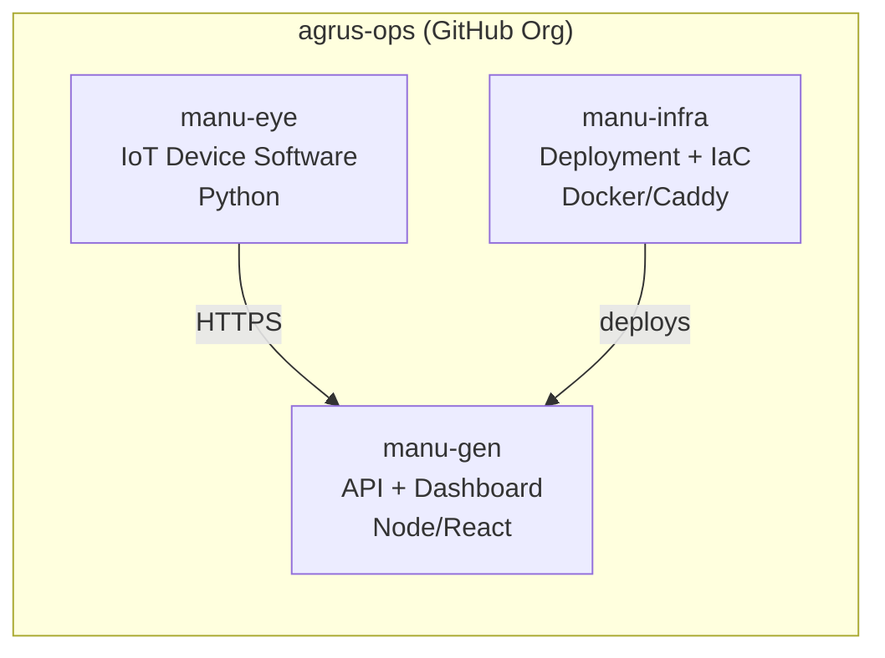
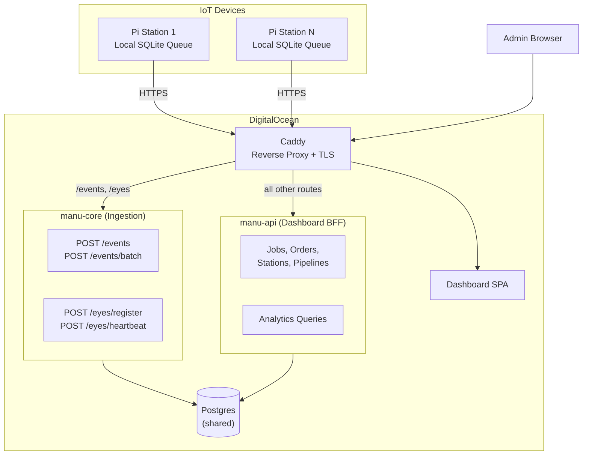
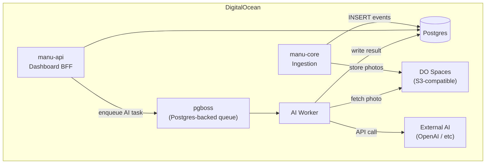
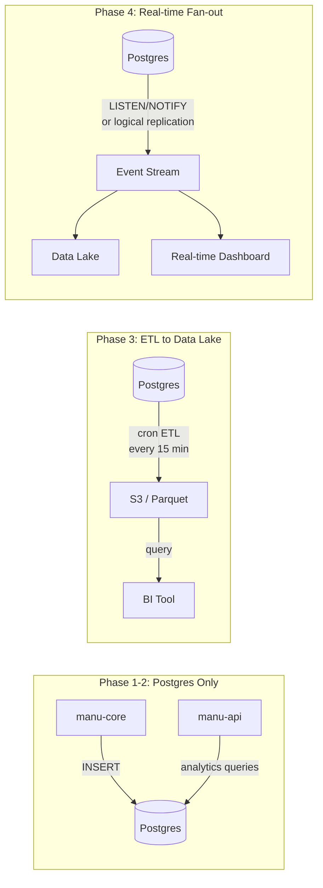
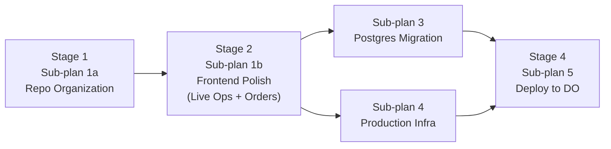

# Production Architecture Plan: PoC to MVP

## Current State

- **Monorepo** (`manu-tracker`) with `manu-gen/backend` (Express + better-sqlite3), `manu-gen/frontend` (React/Vite), and `manu-eye` (Python/OpenCV)
- **SQLite** with WAL mode, schema defined imperatively in [`manu-gen/backend/src/db.ts`](manu-gen/backend/src/db.ts) (8 tables, no migration framework)
- **Docker Compose** for local dev only ([`docker-compose.yml`](docker-compose.yml))
- **CI**: 3 GitHub Actions workflows (path-filtered per component)
- **No production deployment**, no auth, no managed DB

---

## Priority 1: Repository Organization

### Recommendation: Split into 3 repos under `agrus-ops`



**Why this split, not more:**

- **`manu-gen`** (API + Dashboard): Backend and frontend deploy to the same server, share a release cycle, and API changes often require frontend updates. Splitting them into separate repos at this scale adds coordination overhead with zero benefit. Keep as one repo with two directories.
- **`manu-eye`**: Completely different tech stack (Python), completely different deployment target (Raspberry Pi / IoT device), independent release cycle. This is a clear repo boundary.
- **`manu-infra`**: Deployment configs, Docker Compose for production, Caddy config, provisioning scripts. Decoupling infra from app code lets you iterate on deployment without touching application repos, and avoids leaking secrets/configs into app CI.

**Why NOT split further** (e.g. separate backend and frontend repos): You are a solo developer. Each repo boundary adds CI config, version coordination, and context-switching cost. The heuristic: split when different teams or fundamentally different deployment targets exist. Backend + frontend don't qualify yet.

### Migration Steps

1. Create `agrus-ops/manu-gen` repo - move `manu-gen/backend/`, `manu-gen/frontend/`, root `docker-compose.yml`, and relevant CI workflows
2. Create `agrus-ops/manu-eye` repo - move `manu-eye/` and its CI workflow
3. Create `agrus-ops/manu-infra` repo - new; will hold production Docker Compose, Caddy config, deploy scripts, and DigitalOcean provisioning
4. Archive or repurpose the original `manu-tracker` repo (keep as a pointer/docs repo, or archive)

**Repo structure after split:**

```
agrus-ops/manu-gen/
  backend/
    src/
    Dockerfile
    package.json
  frontend/
    src/
    Dockerfile
    package.json
  docker-compose.yml          # local dev (with Postgres container)
  .github/workflows/
    ci-backend.yml
    ci-frontend.yml

agrus-ops/manu-eye/
  src/
  pyproject.toml
  .github/workflows/ci.yml

agrus-ops/manu-infra/
  docker-compose.prod.yml     # production compose (API + frontend + Caddy)
  caddy/Caddyfile
  scripts/
    provision-droplet.sh
    deploy.sh
  .github/workflows/deploy.yml
```

---

## Priority 2: Database Migration (SQLite to Postgres)

### Recommendation: Migrate NOW, before production data exists

**Why now, not later:**

- You are about to deploy to production. There is **zero production data** to migrate. This is the cheapest possible moment.
- 20-30 RPS per station x N stations = real concurrent write pressure. SQLite serializes all writes behind a single writer lock. Postgres handles concurrent writes natively.
- The IoT plan adds batch events, heartbeats, and future AI job queues -- all concurrent writers.
- DigitalOcean Managed Postgres ($15/mo) gives you automatic daily backups and point-in-time recovery for free. With SQLite, you'd have to build your own backup strategy.
- The schema is small (8 tables) with no exotic SQLite features. The migration is low-risk.

### Schema Changes Required

The current schema in [`db.ts`](manu-gen/backend/src/db.ts) needs these Postgres adaptations:

- `INTEGER PRIMARY KEY AUTOINCREMENT` becomes `SERIAL PRIMARY KEY` (or `GENERATED ALWAYS AS IDENTITY`)
- `datetime('now')` becomes `NOW()` or `CURRENT_TIMESTAMP`
- `INSERT OR IGNORE` becomes `INSERT ... ON CONFLICT DO NOTHING`
- `PRAGMA table_info` migrations become proper numbered migration files
- `better-sqlite3` driver replaced with `postgres` (porsager/postgres) or `pg`

### Introduce a Proper Migration Framework

Replace the current imperative schema-in-code approach with **numbered SQL migration files**:

```
backend/
  migrations/
    001_initial_schema.sql
    002_add_eyes_table.sql
    003_add_heartbeats.sql
  src/
    db.ts            # Postgres connection pool + migration runner
```

A lightweight migration runner (read files from `migrations/`, track applied migrations in a `_migrations` table, run unapplied ones in order) is ~50 lines of code and avoids adding a heavy ORM dependency. Alternatively, adopt Drizzle ORM for type-safe queries if you want to move away from hand-written SQL, but this is optional and can be deferred.

### Local Dev: Postgres via Docker Compose

Update the local `docker-compose.yml` to include a Postgres container:

```yaml
services:
  db:
    image: postgres:17
    environment:
      POSTGRES_DB: manugen
      POSTGRES_USER: manugen
      POSTGRES_PASSWORD: local
    ports:
      - "5432:5432"
    volumes:
      - pgdata:/var/lib/postgresql/data
  backend:
    # ... existing config ...
    environment:
      DATABASE_URL: postgres://manugen:local@db:5432/manugen
    depends_on:
      db:
        condition: service_healthy
```

### Production: DigitalOcean Managed Postgres

- Create a Managed Postgres cluster ($15/mo, 1 vCPU, 1GB, 10GB storage)
- Backend connects via `DATABASE_URL` (connection string from DO dashboard)
- TLS enforced by default on managed instances
- Automatic daily backups, 7-day retention

---

## Priority 3: Service Topology -- Phased Split Strategy

### The Decision: Single Process Now, Split When IoT Goes to Production

The backend serves two fundamentally different workloads today:

- **IoT ingestion**: High-frequency writes (events, heartbeats), 20-30 RPS/station, needs ultra-high availability
- **Dashboard BFF**: Read-heavy (board, analytics), bursty, human-paced, runs expensive join queries

These workloads have different scaling axes, availability requirements, and failure blast radii. They should eventually live in separate processes -- but not yet.

### Phase 1 (NOW): Single process, prepare the seam

Deploy one Express backend. But decouple the one cross-domain dependency that would block a future split:

**Current coupling** ([`events.service.ts`](manu-gen/backend/src/features/events/events.service.ts) line 5):

```typescript
import { onTrackingEvent } from "../jobs/jobs.service.js";
```

When an event is inserted, it synchronously calls `onTrackingEvent()` in the jobs domain to update job status. This is the **only import** from events into any other feature.

**Fix**: Replace with a **Postgres trigger** (`AFTER INSERT ON tracking_events`) that performs the same job-status transition logic. This makes the events feature zero-import from other features -- a clean module boundary at the DB level. The trigger runs in the same transaction, so correctness is preserved.

### Phase 2 (When IoT devices go to production): Split into manu-core + manu-api



**manu-core** (ingestion): Tiny, fast, hard to kill. Handles `POST /events`, `POST /events/batch`, `POST /eyes/register`, `POST /eyes/heartbeat`. Writes to Postgres. No complex queries, no joins. Can be independently scaled and independently deployed.

**manu-api** (BFF): All existing CRUD, board views, analytics. Serves the dashboard. Can run expensive aggregation queries without affecting device ingestion.

**Shared Postgres**: Both services read/write the same database. This is the correct level of coupling for a single-team, single-product system. Splitting the database comes only when separate teams own separate domains -- likely never for this product.

**Job status transitions**: Handled by the Postgres trigger (set up in Phase 1). Neither service needs to know about the other's business logic.

**Caddy routing**: Simple path-based routing. `/events/*` and `/eyes/*` go to manu-core; everything else goes to manu-api.

### Phase 3 (AI pipeline): Add workers and task queue



- **pgboss** for async AI task processing (Postgres-backed, no Redis, no new infrastructure)
- **AI worker** as a separate Node process that dequeues tasks, calls external AI, writes results
- **DO Spaces** ($5/mo) for image storage from station cameras
- Station configuration API for per-station prompts and AI model selection

### Why Not Kafka (or any message broker)

**Throughput doesn't justify it**: 30 RPS/station x 50 stations = 1,500 events/sec peak. Postgres handles 5,000-10,000 simple INSERTs/sec on a $15/mo instance. You're orders of magnitude below the threshold.

**Operational cost is disproportionate**: Kafka requires 3+ brokers, partition management, consumer group coordination, and monitoring. DigitalOcean has no managed Kafka -- self-hosting costs ~$100+/mo minimum. Compare: manu-core is one stateless Dockerfile.

**Offline resilience already exists on the device**: The manu-eye local SQLite queue provides the exact durability guarantee Kafka would add between device and server. Events queue on the Pi during network failures and drain on reconnect. Adding Kafka between manu-core and Postgres buffers a hop that's already sub-millisecond within the same datacenter.

**Synchronous INSERT is simpler to reason about**: Device sends event -> HTTP 201 -> event is in Postgres. One round-trip, one source of truth. With Kafka: three hops, two failure points, offset management, dead-letter topics.

**The upgrade path is always open**: If you hit 10k+ events/sec or need multi-consumer fan-out at that scale, adding a broker later is straightforward. Going from "Kafka I don't need" back to a simpler system is painful.

### Data Lake / Analytics Path (Progressive, No Kafka Needed)



- **Phase 1-2**: All analytics from Postgres directly (current analytics endpoints already work)
- **Phase 3**: Periodic ETL job (cron every 15 min) exports new events to S3 as Parquet files. ~50 lines of code, no new infrastructure. Good enough for BI tools and historical analysis.
- **Phase 4**: Postgres logical replication or LISTEN/NOTIFY to stream events to a data lake and/or real-time analytics. Only when query patterns diverge significantly from OLTP.
- **Phase 5 (if ever)**: Kafka or NATS for multi-consumer fan-out at high throughput. Only at 10k+ events/sec or multi-region.

---

## Priority 4: What to Build in Each Phase

**Build NOW (MVP deployment):**
- Postgres migration and migration framework
- Decouple `onTrackingEvent()` with a Postgres trigger (prepares the service-split seam)
- Production Docker Compose with Caddy (HTTPS)
- Health check and basic monitoring endpoints
- DigitalOcean Droplet + Managed Postgres deployment
- CI/CD pipeline for automated deployments (GitHub Actions -> Docker -> Droplet)

**Build in Phase 2 (IoT devices in production):**
- Split backend into manu-core (ingestion) + manu-api (BFF) -- two Express apps, same Postgres
- `eyes` table + auto-registration endpoint (in manu-core)
- `POST /events/batch` + idempotent ingestion with `client_event_id` (in manu-core)
- Device heartbeat endpoint + dashboard device status
- Local event queue in manu-eye (on-device SQLite)
- API key authentication for devices

**Build in Phase 3 (AI pipeline, when business requires it):**
- pgboss task queue for async AI processing (Postgres-backed, no Redis)
- AI worker process (separate Node process)
- Station configuration API (per-station prompts, AI model selection)
- Image storage (DigitalOcean Spaces, $5/mo)
- ETL job for data lake export (cron + Parquet to S3)
- Real-time feedback channel to devices (WebSocket or SSE)

**Build in Phase 4 (multi-tenant, scale):**
- User authentication + organization scoping
- Role-based access control
- Move to DigitalOcean App Platform or Kubernetes
- Postgres logical replication for real-time data lake
- Multi-region if needed

### Key Architectural Decisions

**Postgres as the single source of truth**: Events are INSERT-ed synchronously. No message broker between the API and the database. The device-side SQLite queue provides offline resilience. Postgres provides durability, concurrency, and (via triggers) cross-domain coordination.

**Stateless API servers**: Both manu-core and manu-api are stateless Node processes. Postgres is the only state. This means horizontal scaling is trivial: run more containers behind Caddy.

**Postgres trigger for cross-domain logic**: The `onTrackingEvent` job-status transition moves to a DB trigger. This decouples the ingestion path from the operations domain at the DB level, making the service split mechanical.

**pgboss over Redis/BullMQ**: For the AI task queue, pgboss reuses Postgres (no new infrastructure). It provides reliable job scheduling, retries, and dead-letter handling. Upgrade to BullMQ + Redis only if queue throughput exceeds what Postgres can handle (~1,000 jobs/sec).

### DigitalOcean Cost Projection

- **MVP (now):** $12 Droplet + $15 Managed Postgres = **$27/mo**
- **Phase 2 (5-10 devices):** Upgrade Droplet to $24 (runs both manu-core + manu-api) = **$39/mo**
- **Phase 3 (AI pipeline):** Add Spaces ($5) + possibly second Droplet for worker ($12) = **$56/mo**
- **Phase 4 (scale):** App Platform + managed Postgres + Spaces = **$60-80/mo**

---

## Execution Order

The work is split into 5 sub-plans across 4 sequential stages. Sub-plans 3 and 4 run in parallel.

**Sub-plan file reference:**

- Sub-plan 1a: [`sub-1a-repo-organization.plan.md`](sub-1a-repo-organization.plan.md)
- Sub-plan 1b: [`sub-1b-frontend-polish.plan.md`](sub-1b-frontend-polish.plan.md)
- Sub-plan 3: [`sub-3-postgres-migration.plan.md`](sub-3-postgres-migration.plan.md)
- Sub-plan 4: [`sub-4-production-infra.plan.md`](sub-4-production-infra.plan.md)
- Sub-plan 5: [`sub-5-deploy-digitalocean.plan.md`](sub-5-deploy-digitalocean.plan.md)



### Stage 1: Sub-plan 1a — Repo Organization (start first)

> [Full plan](sub-1a-repo-organization.plan.md)

Create `agrus-ops/manu-gen`, `agrus-ops/manu-eye`, `agrus-ops/manu-infra` repos. Split monorepo with `git filter-repo`, preserving history. Set up CI in each repo.

**Agent scope:** Git operations, GitHub repo creation, CI workflow files

### Stage 2: Sub-plan 1b — Frontend Polish (after repo split)

> [Full plan](sub-1b-frontend-polish.plan.md)

Bring the Live Operations dashboard and Customer Orders views to v2 design fidelity. Match the HTML prototype, align tokens, polish KPI cards, job board, charts, order list/detail/create views. Implement loading/empty/error states per design system spec.

**Agent scope:** `frontend/src/features/dashboard/` + `frontend/src/features/customer-orders/` + shared components/tokens

### Stage 3: Sub-plans 3 + 4 — in parallel (after frontend polish)

#### Sub-plan 3: Postgres Migration

> [Full plan](sub-3-postgres-migration.plan.md)

Migrate backend from SQLite to Postgres. Add migration framework, port schema, swap driver, update all queries, add Postgres trigger for `onTrackingEvent`, update Docker Compose and tests.

**Agent scope:** `backend/` + root `docker-compose.yml`

#### Sub-plan 4: Production Infrastructure

> [Full plan](sub-4-production-infra.plan.md)

Create production Docker Compose, Caddy config, Nginx config, Dockerfiles for production builds, deploy scripts. Lives in `infra/` directory (later becomes `manu-infra` repo content).

**Agent scope:** New `infra/` directory (no conflicts with Sub-plan 3)

### Stage 4: Sub-plan 5 — Deploy to DigitalOcean (after Sub-plans 3 + 4)

> [Full plan](sub-5-deploy-digitalocean.plan.md)

Provision Droplet + Managed Postgres, configure DNS, deploy, verify end-to-end. $27/mo.

**Agent scope:** DigitalOcean provisioning, SSH, deployment

---

### Future phases (not part of the current sub-plans)

9. **Split services** (Phase 2) -- Extract manu-core from manu-api when IoT devices go to production
10. **AI pipeline** (Phase 3) -- pgboss + AI worker + Spaces when business requires it
11. **Data lake** (Phase 3-4) -- ETL cron first, logical replication later
